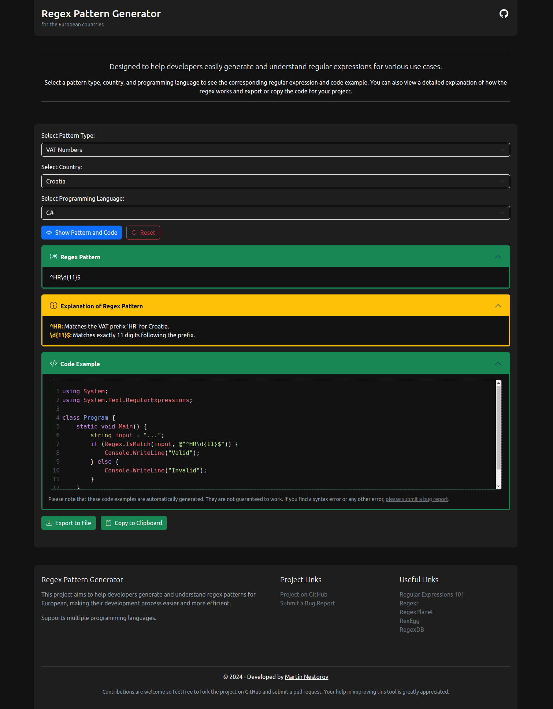

# RegExpert - Generate & Understand Regular Expressions

## Support The Project

Your support is greatly appreciated and will help ensure all of the projects continued development and improvement. Thank you for being a part of the community!
You can send me money on Revolut by following this link: https://revolut.me/mnestorovv

## Overview

**RegExpert - Generate & Understand Regular Expressions** is designed to help developers easily generate and understand regular expressions for various use cases.

Select a pattern type, country, and programming language to see the corresponding regular expression and code example. You can also view a detailed explanation of how the regex works and export or copy the code for your project.

## Changelog

For a detailed list of changes and updates made to this project, please refer to our [Changelog](./CHANGELOG.md).

## Screenshots

## Support The Project

If you find this script helpful and would like to support its development and maintenance, please consider the following options:

- **_Star the repository_**: If you're using this script from a GitHub repository, please give the project a star on GitHub. This helps others discover the project and shows your appreciation for the work done.

- **_Share your feedback_**: Your feedback, suggestions, and feature requests are invaluable to the project's growth. Please open issues on the GitHub repository or contact the author directly to provide your input.

- **_Contribute_**: You can contribute to the project by submitting pull requests with bug fixes, improvements, or new features. Make sure to follow the project's coding style and guidelines when making changes.

- **_Spread the word_**: Share the project with your friends, colleagues, and social media networks to help others benefit from the script as well.

- **_Donate_**: Show your appreciation with a small donation. Your support will help me maintain and enhance the script. Every little bit helps, and your donation will make a big difference in my ability to keep this project alive and thriving.

Your support is greatly appreciated and will help ensure all of the projects continued development and improvement. Thank you for being a part of the community!
You can send me money on Revolut by following this link: https://revolut.me/mnestorovv

---

## License

This project is released under the MIT License.
